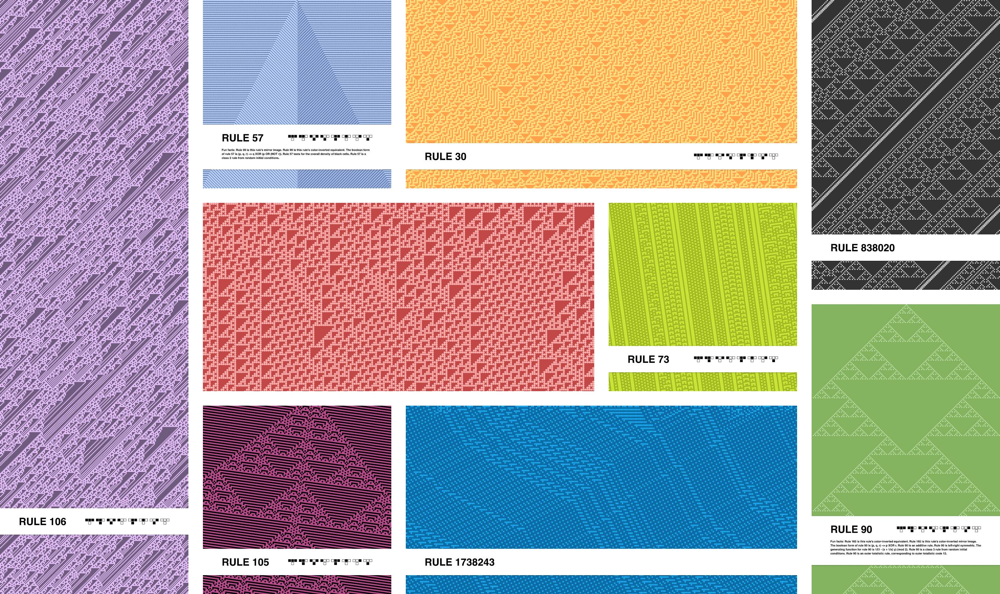

# cellular-automata-posters

Simple Python script that **generates cellular automata posters as PDF** files.

Heavily inspired by [this Reddit post](https://www.reddit.com/r/cellular_automata/comments/6bg60e/2d_cellular_automata_posters/) – **all credit goes to /u/collatz_conjecture**, while any criticism (e.g. for taking their concept and running with it) is to be directed at [me](https://github.com/doersino).


## Examples



You can find the associated PDF files in the `examples/` subdirectory.


## Setup & Usage

The script has been tested with Python 3 and uses the [`cairocffi` package](https://pypi.python.org/pypi/cairocffi) to draw vector shapes to PDF. That package, in turn, depends on CFFI, Cairo and other system-dependent libraries. **Take a look at the [`cairocffi` documentation](http://cairocffi.readthedocs.io/en/latest/overview.html#installing-cffi)** to get started. Further, the [`wolframalpha` package](https://pypi.python.org/pypi/wolframalpha) is used to display "fun facts" about the rules – the script contains a comment explaining how to get the Wolfram|Alpha AppID required to enable this feature.

If you're on macOS, you can run the following commands to set things up – that's what worked for me, anyway:

```bash
$ brew install python3 pkg-config libffi cairo
$ PKG_CONFIG_PATH=/usr/local/opt/libffi/lib/pkgconfig pip3 install cffi
$ pip3 install cairocffi
$ pip3 install wolframalpha
```

Now **adjust the settings in `cap.py` to taste** (they're explained inline, I encourage you to play around with them). Then run the script using

```
$ python3 cap.py
```

after which you'll find the generated PDF file in your working directory.


## Notes

* You can **vary the page aspect ratio** to your heart's content to generate horizontal or ultra-tall posters – the label should still look fine either way.
* If adjusting the settings in the source file feels icky to you, you can use environment variables: Calling the script as `CAP_RULE=57 CAP_WIDTH=400 CAP_ANGLE=5.5 CAP_COLORSCHEME="('#478c49', '#d0c043')" CAP_GRIDMODE='None' CAP_FONT='PragmataPro' CAP_PAGEWIDTH=2000 CAP_DEBUG='True' CAP_FILENAME='optionOverrides.pdf' python3 cap.py` will use the values from the environment variables with all other options set to their defaults. The end result – if you can get a hold of the [PragmataPro font](https://www.fsd.it/shop/fonts/pragmatapro/) – will look like [this](examples/optionOverrides.pdf).
* There are several ways of dealing with the edges of the grid. One of the more common approaches (especially for 2D automata) seems to be to let the grid warp around the edges, i.e. the right neighbor of the right-most cell is the left-most cell and vice versa. That's what I went with for now.
* Possible **improvements or additions** are being kept track of in `TODO.md`. I might not get to all of them, but if you implement anything, feel free to send a pull request.
* Even though the script is licensed under the MIT license which permits commercial use, **it'd be cool if you refrain from selling copies of the posters for profit**.
* Want to find out more in-depth info about this kind of cellular automaton? Read [Stephen Wolfram's paper](https://lainchan.jp/tech/src/1497017334945.pdf).
* Cellular automata [occur in nature](https://www.reddit.com/r/cellular_automata/comments/2ivi13/cellular_automata_shells/), which is kinda cool.
* I recommend using the excellent [`pdf2svg` utility](http://www.cityinthesky.co.uk/opensource/pdf2svg/) if you for some reason prefer the results in SVG. File sizes can get quite large, however: around 10-40 MB for each of the examples shown above.
* Originally, I planned to implement this poster generator in LuaLaTeX and Ti*k*Z (because that's what I was familiar with). Turns out that drawing close to a million Ti*k*Z nodes ain't so fast, so I quickly abandoned that approach and went the Python route. If I'd felt a little more ambitions, I likely would've tried Haskell instead.
